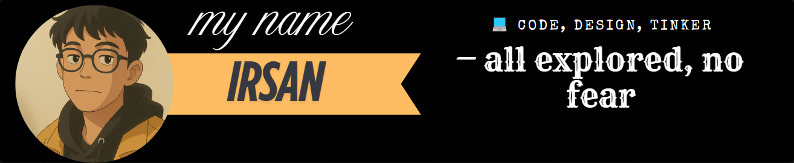

# Hello World!, I'm Irsan, an Indonesian Informatics Engineering Student 👋🏼:
🛜 currently building my own tech website [IRSANWOY](https://irsanwoy.com)  
👨🏼‍🎓 studying Informatics Engineering (6th semester) at [your university name]  
👨🏼‍💻 learning and working on software development projects since 2022  
🎬 also creating content on YouTube and TikTok about tech, and tutorials

# 💻 Tech Stack:

<picture>
  <source media="(prefers-color-scheme: dark)" srcset="https://raw.githubusercontent.com/irsanwoy/irsanwoy/output/github-snake-dark.svg" />
  <source media="(prefers-color-scheme: light)" srcset="https://raw.githubusercontent.com/irsanwoy/irsanwoy/output/github-snake.svg" />
  
</picture>
